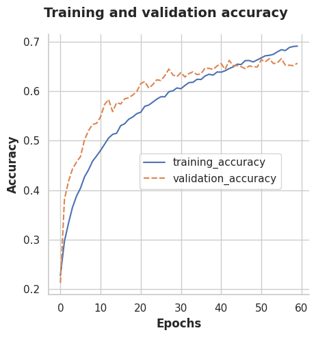
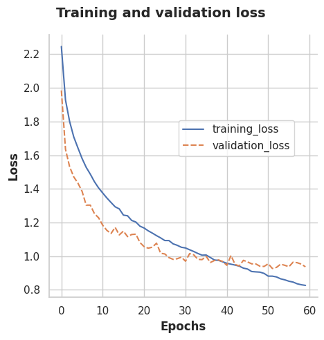
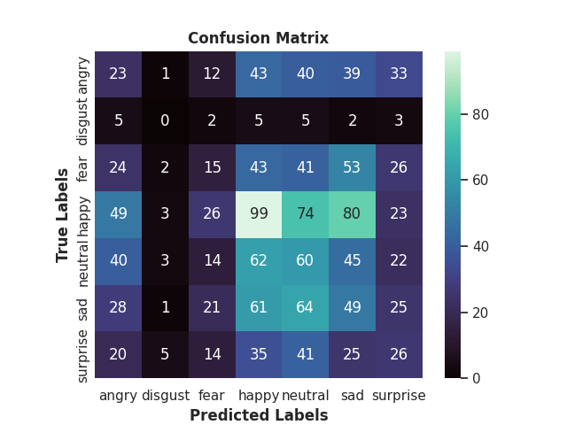

# facial-expression-classifier
DEMO: facial expression recognition with Keras model and pydantic settings

[](https://www.python.org/downloads/release/python-312/)
[](https://opensource.org/licenses/MIT)
[](https://github.com/pre-commit/pre-commit)
[](https://github.com/astral-sh/ruff)
[](https://github.com/astral-sh/uv)

## [UV](https://docs.astral.sh/uv/) Setup
```
uv version
uv self update
uv python install 3.12
uv venv --python 3.12.6
uv python pin pypy@3.12
uv lock
uv sync --refresh
uv run pre-commit autoupdate
uv run pre-commit install --install-hooks
```

### [FER-2013 dataset](https://www.kaggle.com/datasets/msambare/fer2013/code)
* consists of 48x48 pixel grayscale images of human faces
* automatically registered so each face is centered and occupies similar amount of space in each image
* contains 24400 images: with 22968 examples in training and 1432 examples in test
* one of seven categories (0=Angry, 1=Disgust, 2=Fear, 3=Happy, 4=Sad, 5=Surprise, 6=Neutral)

### Train Model:
```
uv run python src/facial_expressions_classifier/run.py --epochs 10 --batch_size 30 --train_model
```

### Plot Visualizations:
```
uv run ./src/facial_expressions_classifier/run.py --plot-history
```






